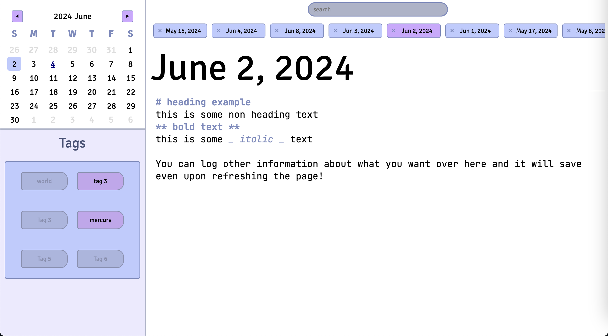

# Team 26 Final Project

[](https://codeclimate.com/github/cse110-sp24-group26/final-project/maintainability)
[](https://codeclimate.com/github/cse110-sp24-group26/final-project/test_coverage)

Developer Journal

## Usage

To use the developer journal, visit the app site [here](https://cse110-sp24-group26.github.io/final-project/). You should be greeted by a page that looks like the image below. The high level idea of this project is that you can log markdown entries to certain days and revisit them in the future.



### Tabs and Entries

The journal allows you to create and edit a single entry for each unique day of the calendar. You can do so by selecting a date on the calendar. This will open a tab where you can edit the entry for that day in the editor. You can have multiple tabs open, and when you're done editing an entry, you can close out the tab by hitting the x on the tab label.

### Calendar Navigation

To navigate to different months and years of the calendar, you can use the arrows to go to next and previous months, or click on the month or year text and select which ever you want from the dropdown.

### Tags

When a tab is open for a day's entry, you can click the tags underneath the calendar to toggle which tags you want to apply to the day. Clicking toggled tags once more allows you to untoggle them for that day. You can right-click the tags to rename them, allowing you to categorize your entries however you please.

### Search

The search bar at the very top center of the screen allows you to search for entries based on their content. For example, by selecting the bar and typing in `UI planning`, you will be shown entries that contain `UI planning` if any. You may also type in dates in the format of `2024-06-01` to quick open the entry for that date if you've opened it before. Finally, you may search for entries with certain tags.

### Text Editor

When typing out your entry, you can enclose your text with underscores `_like so_` to italicize your text, with two asterisks `**like so**` to bolden your text, or with both to italicize AND bolden `**_like so_**`. You can also start lines with `#` to mark it as a heading.

## Development Process
1. During team meetings or on Slack, decide what needs to be worked on in terms of bugs, features, documentation, etc and create issues list
2. For each issue in the list, open an issue accoridng to one of several provided templates. If applicable make sure to assign the person working on that feature in the issue itself
3. Create a new branch for the issue from the issue page so that it is automatically linked and make sure to name the branch according to the conventions below 
4. Add issues to the team board by going to the backlog tab and following the given steps:
    -  Click Add item near the bottom of the "todo" section
    - Input "#" to bring up the repositories and select "final-project"
    - Then search for the brand new issue and select it to add it to the board
5. Develop on the branch and test locally, make sure to update the issue to "in progress" on team board
6. Push on the branch and submit a pull request to staging
7. GitHub actions will ensure that nothing goes wrong in terms of linting and testing
8. Have a manual review by at least one other person
9. Merge into staging
10. Have two other people manually review the staging branch to ensure no unexpected merge conflicts
11. Merge into main, update the issue to "done" on the team board
12. GitHub actions will build the documentation and website
13. Repeat for next issue from step 2 onwards

## Branching
There is the main branch which contains the production code. There is also a staging branch, where we ensure that recent merges do not do anything unexpected. Apart from that, all features or other additions to the project are done in short lived feature branches. 

Development branches are to be named in the form of:
- 'feature/feature-name'
- 'bug/bug-name'
- 'documentation/documentation-name'
- 'devops/devops-name'
- 'testing/testing-name' 

## Coding and Documentation Conventions
- CSS: use rem as much as possible instead of px
- Tab size: 4 spaces
- Lines less than 100 characters
- pascalCase
- Same line curly braces
- Every function is documented, summary for complex files and funcctions with additional comments for complex logic, present tense
- Include examples in comments for complex functions
- Code is as self-documented as possible
- Avoid hard-coded values, use variables for constants

## Testing
Cypress will be used for unit testing, component testing, and end to end testing. Make sure to use the appropriate tests for each stage of development.

## Commit Messages
Make sure to use our git commit message template when possible

```
# Title: Type of commit (issue adressed), Summary, imperative, start upper case, don't end with a period
# No more than 50 chars. #### 50 chars is here:  #

# Remember blank line between title and body.

# Body: Explain *what* and *why* (not *how*).
# Wrap at 72 chars. ################################## which is here:  #
```

## Additional Notes
1. Make sure to follow our cipipeline when possible. I.e. create an issue and feature for each task. Once finished **submit a pull request to the staging branch NOT main**.
2. Source files are present in the `src` directory which you should be to host directly (i.e. `serve .` or LivePreview) to actually use the application
3. Test files are present under `cypress/{e2e,component,unit}`
4. Use `npm run docs` for generating documentation (locally) and `npm test` for running tests (in headless mode)
5. Use `npm run lint` to run linter

